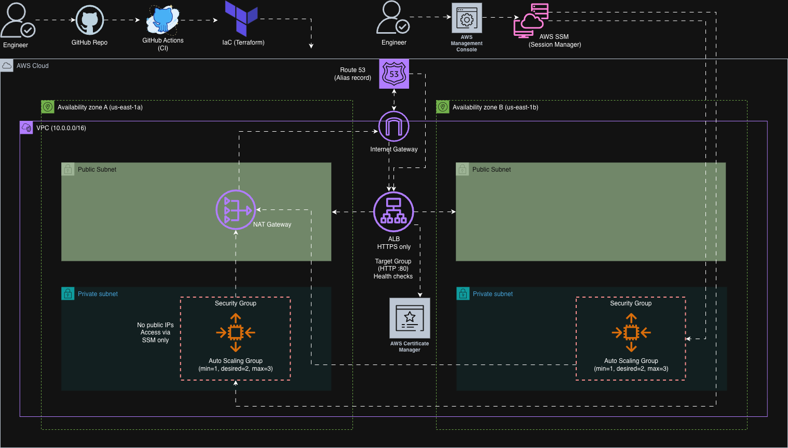

# Terraform AWS Foundations


A progressive, hands-on build of production-grade AWS infrastructure using Terraform — from a single EC2 instance to a fully automated, self-healing, HTTPS-enabled application stack.

Each stage introduces a real-world pattern used in professional DevOps environments, with stacks wired together via remote state rather than manual variable passing.

---

## Architecture



---

## What Was Built

Each directory is a self-contained Terraform stack that builds on the previous one.

| Stage | Topic | AWS Services | Highlight |
|-------|-------|-------------|-----------|
| Day 01 | EC2 with Reusable Modules | EC2, Security Groups, S3 | Custom `ec2` and `security_group` modules; S3 remote backend from day one |
| Day 08 | Production VPC | VPC, Subnets, NAT Gateway, Route Tables | Multi-AZ public/private subnets; NAT Gateway for private subnet egress |
| Day 09 | Secure Workloads | EC2, IAM, Security Groups | Private compute with no public IPs; security-group-to-security-group ingress rules |
| Day 10 | Application Load Balancer | ALB, Target Groups, Listeners | Health-check-driven traffic routing; listener rules and target group registration |
| Day 11 | HTTPS & DNS | ACM, Route 53, ALB | TLS termination at the ALB with ACM-managed certificate; HTTP → HTTPS redirect enforced |
| Day 12 | Auto Scaling Group | ASG, Launch Template, IAM | Replaced manual EC2 with an ASG; instance bootstrapping via `user_data` |
| Day 13 | Zero-Bastion Access | SSM Session Manager, IAM | Eliminated the bastion host entirely; port 22 never opened anywhere |
| Day 14 | Autoscaling Policies | CloudWatch Alarms, ASG Policies | CPU-driven scale-out (>60%) and scale-in (<20%) with cooldown periods; self-healing validated |

---

## Key Engineering Decisions

**Remote state as the integration layer**
Each stack stores its outputs in S3 and reads upstream stacks via `terraform_remote_state`. This is how real teams manage multi-stack environments without tight coupling or manual variable passing between configs.

**Private compute, public load balancer**
Application instances run exclusively in private subnets with no public IPs. Only the ALB is internet-facing. This is the standard perimeter model for production workloads — blast radius is contained at the edge.

**SSM Session Manager over bastion host**
The bastion host was introduced in Day 9 and deliberately removed in Day 13. SSM provides audited shell access with zero attack surface: no key pair management, no open port 22, no publicly addressable EC2.

**HTTPS enforced at the edge**
TLS is terminated at the ALB using an ACM-managed certificate. A dedicated listener rule redirects all HTTP traffic to HTTPS — no plaintext traffic reaches the application layer.

**ASG owns compute, not Terraform**
Rather than managing individual EC2 instances, Terraform provisions the Launch Template and ASG configuration. The ASG handles instance placement, replacement on failure, and capacity autonomously.

**CloudWatch-driven scaling with cooldowns**
Scale-out triggers when average CPU exceeds 60% for 2 consecutive minutes. Scale-in triggers when it drops below 20% for 5 minutes. Cooldown periods are set to prevent oscillation under variable load.

---

## Stack

| Layer | Technology |
|-------|-----------|
| IaC | Terraform |
| Compute | AWS EC2, Auto Scaling Groups, Launch Templates |
| Networking | VPC, Public/Private Subnets, NAT Gateway, Route Tables |
| Load Balancing | Application Load Balancer, Target Groups, Listeners |
| TLS / DNS | AWS ACM, Route 53 |
| Access | AWS SSM Session Manager |
| Identity | AWS IAM (roles, instance profiles, policies) |
| Observability | CloudWatch Alarms, Metrics |
| State Backend | S3 |

---

## How to Use

Stacks must be applied in order — each one reads the remote state of the previous.

```bash
# Configure your AWS credentials
export AWS_PROFILE=your-profile

# Enter a stage directory and update backend.tf with your S3 bucket details
cd day08-vpc

# Init and apply
terraform init && terraform apply
```

Apply in sequence: `day01` → `day08-vpc` → `day09-secure-workloads` → `day10-alb` → `day11-https` → `day12-autoscaling` → `day14-autoscaling-policies`
